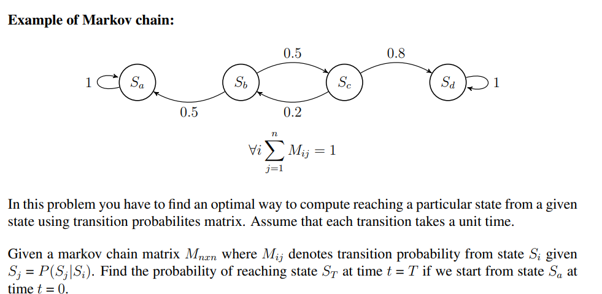

# Markov Chains

Markov Chains is a stochastic model describing a sequence of possible events in which the
probability of each event depends only on the state attained in the previous event. We can 
represent it using a digraph, where the nodes represent states and edges represent transition probabilities.

## Assignment 1

Consider the following problem -



Write a code in Python to solve the above.

## Solution

Let $\{X_0, X_1, X_2, \dots \}$ be a Markov chain with $N × N$ transition matrix P. Then the t-step transition probabilities are given by the matrix $P^t$.

That is, 
$$P(X_t = j | X_0 = i) =  P(X_{n+t} = j | X_n = i) = (P^t)_{i,j}$$ for any $n$

## Implementation

### Input format
- $n$ - number of states. States being labeled by integers from $0$ to $n-1$
- initial state at time $t = 0$
- final state at time $t = T$
- $T$ - the time at which probability is wanted
- The transition probability matrix (in row by column format)

```
4
1
4
7
1 0 0 0
0.5 0 0.5 0
0 0.2 0 0.8
0 0 0 1
```
### Output format

A single float value denoting the probability of reaching given final state at time $t = T$ starting from given initial state at $t = 0$.
```
0.1
```
