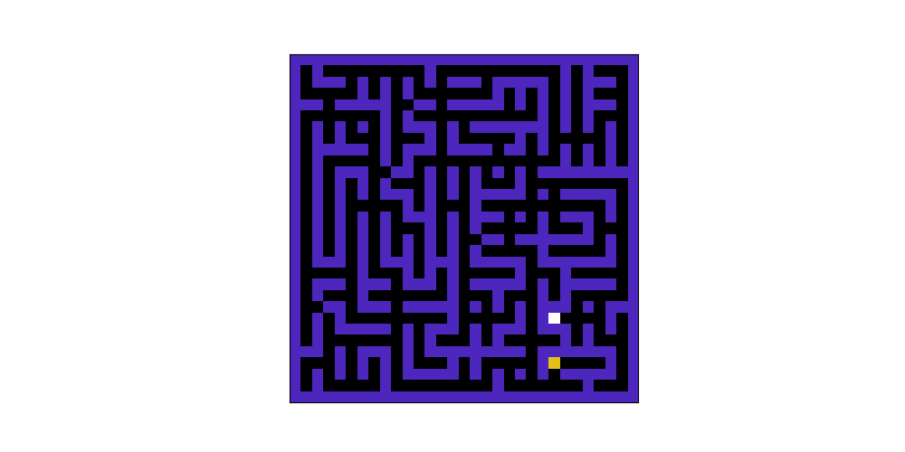

# Maze Solver

The problem statement can be found [here](https://www.cse.iitb.ac.in/~shivaram/teaching/old/cs747-a2020/pa-2/programming-assignment-2.html)

 


The yellow block is the start point and white block is the end point

## Running Instructions
### Planner
Given an MDP, `planner.py` computes the optimal value function $ V^ * $ and an optimal policy $\pi^ *$ by applying the algorithm that is specified through the command line, among $\{vi, hpi, lp\}$
```
python3 planner.py --mdp <path to input mdp text file> --algorithm <algorithm>
```
I have implemented only value iteration algorithm right now, and that also can be optimized if needed.

### Encoder
`encoder.py` encodes a maze grid into MDP
```
python3 encoder.py --grid <path to gridfile> > <mdpfile name>
```

### Decoder
`decoder.py` simulates the optimal policy and outputs the path taken between the start and end state given the file value_and_policy_file (which is output of `planner.py`) and the gridfile
```
python3 decoder.py --grid <path to gridfile> --value_policy value_and_policy_file
```

### Verifier
- `python3 PlannerVerifyOutput.py --mdp --algorithm vi` to test planner
- `python3 MazeVerifyOutput.py --mdp --algorithm vi` to test final maze solving

### Visualization
- `python visualize.py <path to gridfile>` for visualizing the maze
- `python visualize.py <path to gridfile> <solution path file>` for visualizing the maze solving solution

### All together
```
./run.sh <grid file name>   
```
for running planner, encoder, decoder and outputing the final solution using $vi$ algorithm